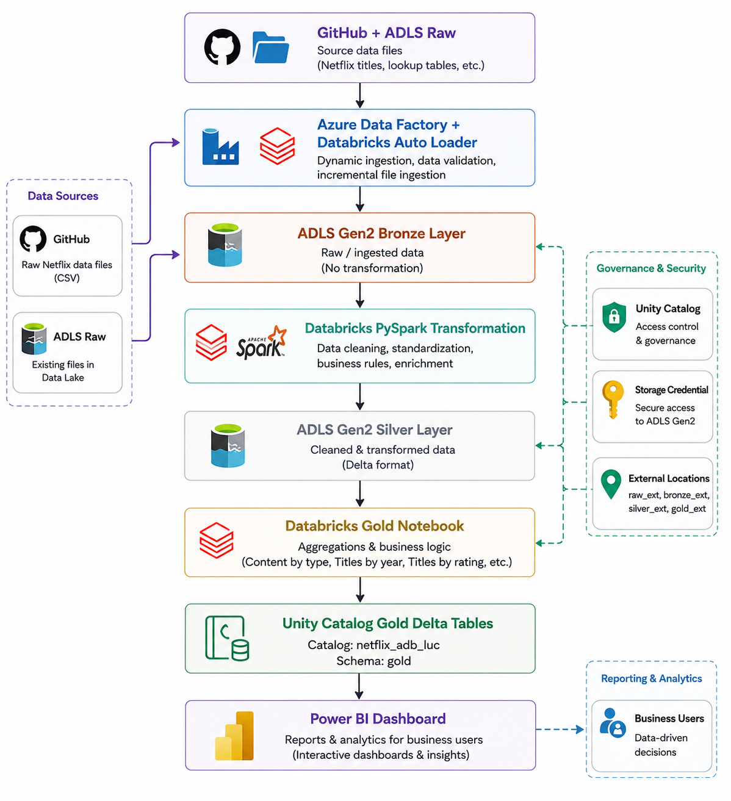
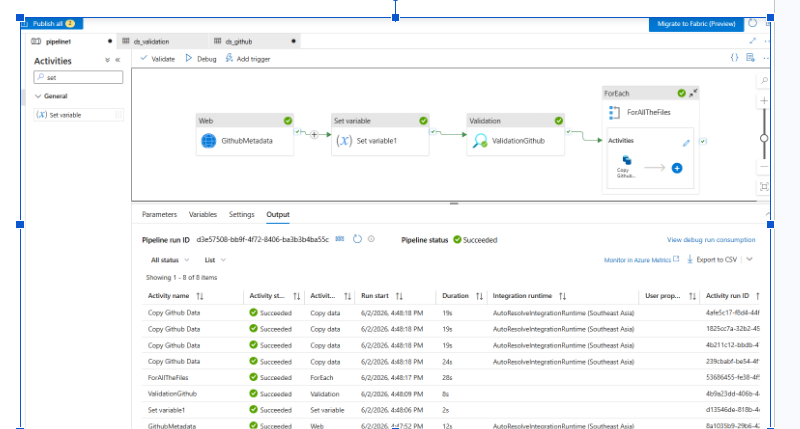
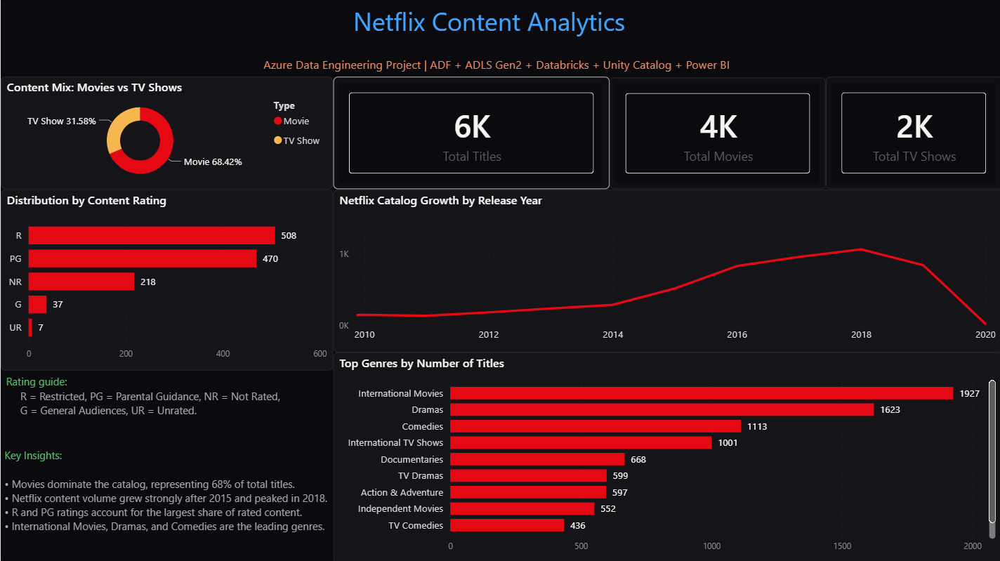

# 🎬 Netflix Content Analytics — Azure End-to-End Data Engineering Project


> A production-style data engineering pipeline built on Microsoft Azure, demonstrating the full lifecycle from ingestion to visualization using modern Lakehouse architecture.



---

## 📋 Table of Contents

- [Overview](#overview)
- [Business Requirements](#business-requirements)
- [Solution Architecture](#solution-architecture)
- [Technology Stack](#technology-stack)
- [Data Source](#data-source)
- [Azure Data Factory Ingestion](#azure-data-factory-ingestion)
- [Databricks Lakehouse Processing](#databricks-lakehouse-processing)
- [Medallion Architecture](#medallion-architecture)
- [Data Governance with Unity Catalog](#data-governance-with-unity-catalog)
- [Analytics Use Cases](#analytics-use-cases)
- [Power BI Dashboard](#power-bi-dashboard)
- [Repository Structure](#repository-structure)
- [Prerequisites](#prerequisites)
- [Workflow Execution Order](#workflow-execution-order)
- [Data Dictionary](#data-dictionary)
- [Data Quality Checks](#data-quality-checks)
- [Skills Demonstrated](#skills-demonstrated)
- [Key Learnings](#key-learnings)
- [Future Improvements](#future-improvements)
- [Acknowledgments](#acknowledgments)

---

## Overview

This project demonstrates an end-to-end Azure Data Engineering pipeline built using a modern Lakehouse architecture. The solution ingests Netflix datasets from GitHub, stores them in Azure Data Lake Storage Gen2 (ADLS Gen2), processes data through Bronze, Silver, and Gold layers using Azure Databricks, and delivers analytics-ready datasets to Power BI.

The project emphasizes production-oriented engineering practices including dynamic ingestion, incremental processing, workflow orchestration, data governance, and analytics reporting.

---

## Business Requirements

### Business Objective

Netflix's content catalog spans thousands of Movies and TV Shows across multiple regions, genres, and maturity ratings. The business requires an automated, reliable data pipeline that ingests raw content metadata, validates data quality, and produces analytics-ready datasets — enabling stakeholders to make data-driven decisions about content strategy, audience targeting, and catalog growth.

### Stakeholder Questions

The pipeline must deliver curated data that answers the following business questions:

| # | Question | Business Value |
|---|----------|----------------|
| 1 | How many titles are in the catalog, split by Movies vs. TV Shows? | Measures catalog composition and content investment balance |
| 2 | Which content ratings (e.g., TV-MA, PG-13) dominate the catalog? | Informs audience targeting and content acquisition strategy |
| 3 | How has content volume changed by release year? | Reveals growth trends and identifies peak production periods |
| 4 | Which genres are most represented in the catalog? | Supports content recommendation and gap analysis |
| 5 | What are the top release years by title count? | Highlights content concentration for trend reporting |

### Functional Requirements

| ID | Requirement | Implementation |
|----|-------------|----------------|
| FR-01 | Ingest lookup tables (cast, directors, countries, categories) from GitHub into the data lake | Azure Data Factory with parameterized HTTP datasets |
| FR-02 | Validate source file availability before ingestion begins | ADF Validation Activity as a pipeline gatekeeper |
| FR-03 | Support dynamic, multi-file ingestion without per-file pipelines | ADF ForEach activity with pipeline array parameter |
| FR-04 | Incrementally ingest the main `netflix_titles` dataset (no full reloads) | Databricks Auto Loader with checkpoint-based tracking |
| FR-05 | Clean, standardize, and enrich raw data (nulls, types, ratings, rankings) | PySpark Silver layer transformations |
| FR-06 | Produce pre-aggregated Gold tables optimized for BI consumption | Databricks Gold notebook writing to Unity Catalog |
| FR-07 | Serve Gold tables to Power BI without file-path dependencies | Databricks SQL Warehouse with Unity Catalog managed tables |
| FR-08 | Orchestrate multi-notebook pipeline execution with dependencies | Databricks Workflows with task values and widget parameters |

### Non-Functional Requirements

| ID | Requirement | Approach |
|----|-------------|----------|
| NFR-01 | **Cost Efficiency** — Minimize unnecessary compute spend | Auto-terminating clusters (20 min), incremental processing, LRS storage |
| NFR-02 | **Governance** — Centralized access control without hardcoded credentials | Unity Catalog + Access Connector + Storage Credentials |
| NFR-03 | **Scalability** — Pipeline must handle additional datasets without redesign | Parameterized notebooks, dynamic ADF ForEach, reusable ingestion framework |
| NFR-04 | **Reliability** — Prevent duplicate processing and ensure data consistency | Auto Loader exactly-once semantics, Delta Lake ACID transactions |
| NFR-05 | **Maintainability** — Single codebase for multi-dataset processing | Widget-parameterized notebooks, centralized configuration via task values |

### Expected Deliverables

1. **Data Lake** — Structured ADLS Gen2 storage with `raw`, `bronze`, `silver`, and `gold` containers
2. **Ingestion Pipeline** — ADF pipeline with validation, dynamic ForEach, and parameterized copy activities
3. **Lakehouse Processing** — Databricks notebooks implementing the full Bronze → Silver → Gold medallion flow
4. **Gold Tables** — Six pre-aggregated Unity Catalog tables covering all stakeholder questions
5. **Dashboard** — Power BI report connected to Databricks SQL Warehouse with KPIs, trends, and distributions

---

## Solution Architecture

### Data Flow

```text
GitHub Source Files
        ↓
Azure Data Factory
        ↓
ADLS Gen2 (Raw)
        ↓
Databricks Auto Loader
        ↓
Bronze Layer (Delta)
        ↓
PySpark Transformations
        ↓
Silver Layer (Delta)
        ↓
Gold Delta Tables (Unity Catalog)
        ↓
Databricks SQL Warehouse
        ↓
Power BI Dashboard
```

---

## Technology Stack

| Component         | Technology                   |
| ----------------- | ---------------------------- |
| Orchestration     | Azure Data Factory           |
| Storage           | Azure Data Lake Storage Gen2 |
| Processing        | Azure Databricks             |
| Ingestion         | Databricks Auto Loader       |
| Transformation    | PySpark                      |
| Storage Format    | Delta Lake                   |
| Governance        | Unity Catalog                |
| Analytics Serving | Databricks SQL Warehouse     |
| Visualization     | Power BI                     |
| Source Control    | GitHub                       |

---

## Data Source

The project uses the [Netflix Movies and TV Shows](https://www.kaggle.com/datasets/shivamb/netflix-shows) dataset. The data is split into a main titles file and several lookup tables:

| Dataset             | Description                       |
| ------------------- | --------------------------------- |
| `netflix_titles`    | Main catalog of Movies & TV Shows |
| `netflix_cast`      | Cast members per title            |
| `netflix_category`  | Genre/category classifications    |
| `netflix_countries` | Country availability per title    |
| `netflix_directors` | Director information per title    |

> **Note:** Raw data files are not included in this repository. They are ingested at runtime from GitHub and ADLS Gen2 as part of the pipeline.

---

## Azure Data Factory Ingestion

Azure Data Factory was used to orchestrate ingestion of Netflix lookup datasets from GitHub into ADLS Gen2.

### Features

* Parameterized datasets for reusable ingestion
* Validation activity for source-file verification
* Dynamic ForEach processing for multiple lookup tables
* Reusable ingestion framework
* GitHub → ADLS Gen2 data movement



---

## Databricks Lakehouse Processing

Azure Databricks was used to implement the Medallion Architecture and process data through Bronze, Silver, and Gold layers.

### Key Features

* Auto Loader incremental ingestion with checkpoint-based state tracking
* Delta Lake storage with ACID transaction support
* PySpark transformations including window functions and ranking
* Databricks Workflows orchestration with task dependencies
* Unity Catalog governance for centralized data management

Databricks Workflows orchestrate notebook execution using task dependencies, widgets, and task values, enabling reusable and scalable pipeline execution.

---

## Medallion Architecture

| Layer  | Purpose                           |
| ------ | --------------------------------- |
| Bronze | Raw ingestion storage             |
| Silver | Cleansed and transformed datasets |
| Gold   | Business-ready analytical tables  |

### Silver Layer Transformations

* Missing value handling with `fillna()` dictionary patterns
* Data type conversion (string → integer for duration fields)
* String cleansing and splitting for rating standardization
* Feature engineering (content type flags)
* Window functions with `dense_rank()` for duration ranking

### Gold Layer Analytics

Gold tables generated for reporting:

```text
netflix_adb_luc.gold

├── gold_content_by_type
├── gold_titles_by_rating
├── gold_titles_by_release_year
├── gold_titles_by_release_year_trend
├── gold_top_genres
└── gold_top20_release_years
```

---

## Data Governance with Unity Catalog

Unity Catalog provides centralized governance and secure access management for the Lakehouse architecture.

### Components

* **Access Connector** — Managed identity between Databricks and ADLS Gen2
* **Storage Credential** — Authentication layer for Unity Catalog to access Azure Storage
* **External Locations** — Maps Unity Catalog to specific ADLS Gen2 container paths (`raw`, `bronze`, `silver`, `gold`)
* **Managed Gold Tables** — Registered in Unity Catalog for SQL access and data discovery

### Benefits

* Centralized governance and fine-grained access control
* Secure ADLS Gen2 connectivity without hardcoded credentials
* Simplified data discovery through Catalog Explorer
* Direct Power BI integration through SQL Warehouse

---

## Analytics Use Cases

The final analytics layer enables stakeholders to answer questions such as:

* How many Movies versus TV Shows exist in the catalog?
* Which content ratings dominate Netflix?
* How has content volume evolved over time?
* Which genres are most common?
* What are the most active release years?

---

## Power BI Dashboard

Gold tables are exposed through Databricks SQL Warehouse and consumed directly by Power BI.

### Dashboard Highlights

* Content type distribution (Movies vs. TV Shows)
* Rating analysis by content maturity classification
* Release year trends and catalog growth over time
* Genre analysis across the full catalog
* KPI summary metrics (Total Titles, Movies, TV Shows)



---

## Repository Structure

```text
Netflix_Azure_End_to_end_DE_Project/
│
├── notebooks/
│   ├── 01_Autoloader.ipynb              # Incrementally ingests main titles data from Raw to Bronze with Auto Loader
│   ├── 02_Silver_Titles.ipynb           # Reusable parameterized notebook for moving lookup tables from Bronze to Silver
│   ├── 03_Lookup_Ingestion.ipynb        # Defines lookup-table metadata and shares it with Databricks Workflows task values
│   ├── 04_Silver_Transformation.ipynb   # Cleans, enriches, validates, and writes the main netflix_titles Silver Delta dataset
│   ├── 05_Gold_Notebook.ipynb           # Builds Gold reporting tables for content type, ratings, and release-year analytics
│   └── 05_Gold_Top_Geners.ipynb         # Builds the Gold genre distribution table used by the Power BI dashboard
│
├── images/
│   ├── architecture_newest.png          # Solution architecture diagram
│   └── 03_ADF_Realtime.png             # ADF pipeline design
│
├── dashboard/
│   ├── netflix_dashboard.png            # Dashboard screenshot
│   ├── netflix_dashboard_redesign.md    # Dashboard design spec
│   ├── netflix_powerbi_theme.json       # Power BI theme (v1)
│   └── netflix_powerbi_theme_v2_clean.json  # Power BI theme (v2)
│
├── .gitignore
├── pyproject.toml
└── README.md
```

---

## Prerequisites

To explore or extend this project, you will need:

| Requirement                | Details                                                  |
| -------------------------- | -------------------------------------------------------- |
| Azure Account              | Free tier available at [azure.microsoft.com](https://azure.microsoft.com/en-us/free/) |
| Azure Data Factory         | For pipeline orchestration                               |
| Azure Data Lake Storage Gen2 | With hierarchical namespace enabled                    |
| Azure Databricks           | Premium tier (required for Unity Catalog)                |
| Power BI Desktop           | For dashboard visualization                              |

---

## Workflow Execution Order

The Databricks workflow is designed to run in this order:

| Step | Notebook | Purpose |
|------|----------|---------|
| 1 | `01_Autoloader.ipynb` | Incrementally ingest `netflix_titles` from ADLS Raw into Bronze Delta using Auto Loader |
| 2 | `03_Lookup_Ingestion.ipynb` | Publish lookup table metadata through Databricks task values |
| 3 | `02_Silver_Titles.ipynb` | Process lookup datasets dynamically from Bronze into Silver |
| 4 | `04_Silver_Transformation.ipynb` | Clean, enrich, validate, and write the main `netflix_titles` Silver Delta dataset |
| 5 | `05_Gold_Notebook.ipynb` | Create Gold aggregates for content type, rating, and release-year reporting |
| 6 | `05_Gold_Top_Geners.ipynb` | Create the Gold genre distribution table for Power BI |

---

## Data Dictionary

Key fields used by the Silver and Gold layers:

| Column | Layer | Description |
|--------|-------|-------------|
| `show_id` | Bronze/Silver/Gold | Unique Netflix title identifier used to join lookup tables |
| `type` | Bronze/Silver/Gold | Content category, usually `Movie` or `TV Show` |
| `title` | Bronze/Silver | Original title name |
| `short_title` | Silver | Title text before the first colon, used for cleaner reporting labels |
| `date_added` | Silver | Date the title was added, converted to a date type |
| `release_year` | Silver/Gold | Release year used for trend and top-year analysis |
| `rating` | Silver/Gold | Content maturity rating after trimming and standardization |
| `duration_minutes` | Silver | Movie duration converted to integer minutes |
| `duration_seasons` | Silver | TV show duration converted to integer seasons |
| `type_flag` | Silver | Numeric content type indicator: `1` for Movie, `2` for TV Show, `0` otherwise |
| `duration_ranking` | Silver | Dense rank of titles by movie duration |
| `listed_in` | Silver/Gold | Genre/category value from the lookup dataset |

---

## Data Quality Checks

The Silver transformation notebook includes validation checks before writing curated data:

* Confirms the transformed dataset is not empty
* Checks for duplicate `show_id` values
* Verifies required reporting columns are not null
* Displays a compact quality summary for workflow monitoring

These checks make the pipeline easier to troubleshoot and prevent incomplete data from flowing into Gold tables and Power BI.

---

## Skills Demonstrated

* **Cloud Platform:** Azure Data Factory, Azure Databricks, Azure Data Lake Storage Gen2
* **Data Ingestion:** Databricks Auto Loader, parameterized ADF pipelines
* **Data Processing:** PySpark, Delta Lake, Spark SQL
* **Architecture:** Medallion Architecture (Bronze / Silver / Gold)
* **Orchestration:** Databricks Workflows with task dependencies and parameterization
* **Governance:** Unity Catalog, Storage Credentials, External Locations
* **Visualization:** Power BI with custom Netflix-themed dark design
* **Best Practices:** Incremental processing, dynamic notebooks, cost management

---

## Key Learnings

1. **Auto Loader vs. Batch Ingestion** — Auto Loader's checkpoint-based incremental processing significantly reduces compute costs compared to full dataset reloads.
2. **Unity Catalog Governance** — The Access Connector → Storage Credential → External Location chain provides secure, credential-free access to ADLS Gen2 from Databricks.
3. **Parameterized Pipelines** — Using pipeline array parameters and ForEach activities in ADF eliminates the need for one-pipeline-per-file patterns.
4. **Databricks Workflows** — Task values and widget parameterization enable reusable notebooks that process multiple datasets without code duplication.
5. **Medallion Architecture** — Separating raw, cleansed, and business-ready data into distinct layers improves data quality, governance, and analytics performance.

---

## Future Improvements

* Replace full Silver overwrite with a Delta Lake `MERGE` pattern for incremental upserts.
* Add Databricks Workflow retry policies, failure notifications, and run-level logging.
* Add schema drift handling and quarantine logic for malformed records.
* Separate environment configuration for dev, test, and production deployments.
* Add CI/CD using Databricks Asset Bundles or GitHub Actions.
* Add Power BI refresh documentation and deployment notes.

---

## Acknowledgments

* Dataset sourced from [Kaggle — Netflix Movies and TV Shows](https://www.kaggle.com/datasets/shivamb/netflix-shows)
* Project inspired by [Ansh Lamba's Azure Data Engineering tutorial](https://www.youtube.com/watch?v=uc-u_juRg-w)
