# Netflix Azure End-to-End Data Engineering Pipeline

> **Stack:** Azure Data Factory · ADLS Gen2 · Databricks PySpark · Delta Live Tables · SQL Warehouse · Power BI  
> **Architecture:** Medallion (Raw → Bronze → Silver → Gold)  
> **Source:** [Netflix Titles Dataset](https://github.com/anshlambagit/Netflix_Azure_Data_Engineering_Project)

---

## Table of Contents
1. [Project Overview](#project-overview)
2. [Architecture](#architecture)
3. [Data Understanding](#data-understanding)
4. [Infrastructure Setup](#infrastructure-setup)
5. [Bronze Layer — Raw Ingestion (ADF)](#bronze-layer)
6. [Silver Layer — Transformations (Databricks PySpark)](#silver-layer)
7. [Gold Layer — Delta Live Tables](#gold-layer)
8. [Consumption — SQL Warehouse & Power BI](#consumption)
9. [How to Reproduce](#how-to-reproduce)
10. [Lessons Learned](#lessons-learned)

---

## Project Overview

This project builds a production-style batch ELT pipeline on Azure that ingests raw Netflix titles data from GitHub, processes it through a medallion architecture, and delivers a star schema ready for BI reporting.

> **Note on dataset complexity:** This project uses a structured tutorial dataset where the star schema is defined upfront. In production pipelines, the data understanding phase typically requires iterative EDA, stakeholder interviews, and schema negotiation before any ingestion begins.

**Business questions answered:**
- [ ] _[Add your Power BI questions here after Gold layer is built]_
- [ ] _e.g. What is the content distribution by country?_
- [ ] _e.g. How has Netflix's content mix (Movies vs TV Shows) shifted by year?_

---

## Architecture



```
GitHub (Source)
      │
      ▼
Azure Data Factory — Validation → Web Activity → ForEach → Copy Activity
      │
      ▼
ADLS Gen2 ── raw/          ← trigger file (netflix_titles.csv)
      │
      ▼
ADLS Gen2 ── bronze/       ← 4 CSV files in separate folders, no transforms
      │
      ▼
Databricks PySpark          ← Auto Loader + parameterized Workflows
      │
      ▼
ADLS Gen2 ── silver/        ← cleaned, typed, validated Delta tables
      │
      ▼
Delta Live Tables (DLT)     ← star schema built declaratively
      │
      ▼
ADLS Gen2 ── gold/          ← fact + dimension tables
      │
      ▼
SQL Warehouse → Power BI    ← reporting layer
```

**Key design decision — Bronze rule:**  
Bronze stores raw data exactly as the source sent it. Any bug discovered in Silver or Gold is fixed by reprocessing from Bronze — no need to re-ingest from the source. This makes the pipeline auditable and replayable.

---

## Data Understanding

### Source Files
| File | Role | Notes |
|---|---|---|
| `netflix_titles.csv` | Fact table source | PK: `show_id`, also used as validation trigger file |
| `netflix_cast.csv` | Dimension | Joins on `show_id` |
| `netflix_category.csv` | Dimension | Joins on `show_id` |
| `netflix_countries.csv` | Dimension | Joins on `show_id` |
| `netflix_directors.csv` | Dimension | Joins on `show_id` |

### Star Schema
- **Fact table:** `netflix_titles` — PK: `show_id`
- **Dimension tables:** `directors`, `cast`, `countries`, `category` — all join on `show_id`

### Data Quality Issues Found (from EDA)
| Column | Issue | Severity |
|---|---|---|
| `show_id` | 4 null values — violates PK NOT NULL + UNIQUE constraints | 🔴 Critical |
| `duration_minutes` | dtype `object` due to NaN mixed with numeric strings | 🟡 Medium |
| `duration_seasons` | dtype `object`, should be int | 🟡 Medium |
| `date_added` | stored as string, needs date parsing | 🟡 Medium |
| `release_year` | float64 due to nulls, should be int | 🟡 Medium |
| `rating` | 13 nulls | 🟢 Low |
| `description` | 3 nulls | 🟢 Low |

### Key Insight — Mutually Exclusive Columns
`duration_minutes` and `duration_seasons` are governed by the `type` column:
- `type = 'Movie'` → `duration_minutes` populated, `duration_seasons` = NULL
- `type = 'TV Show'` → `duration_seasons` populated, `duration_minutes` = NULL

These nulls are **intentional**, not dirty data. Do not drop them.

---

## Infrastructure Setup

### Azure Resources
| Resource | Name | Region | Purpose |
|---|---|---|---|
| Resource Group | `RG-NetflixProject` | Southeast Asia | Logical container for all resources |
| Storage Account (ADLS Gen2) | `nextflixprojectdtl` | Southeast Asia | Data lake (hierarchical namespace enabled) |
| Containers | `raw`, `bronze`, `silver`, `gold` | — | Medallion layers |
| Azure Data Factory | `adf-netflix-luc-dt` | Southeast Asia | Pipeline orchestration |
| Databricks Workspace | `Netflix-ADB-<yourname>` | Southeast Asia | PySpark transforms + DLT |

> **Region note:** ADF creation was blocked in East US under Azure for Students. Southeast Asia used throughout — keeping all resources in the same region avoids cross-region egress costs and latency.

> **Storage naming:** `nextflixprojectdtl` follows Azure constraints (lowercase, no hyphens, ≤24 chars) because the name becomes a DNS endpoint: `https://nextflixprojectdtl.dfs.core.windows.net`

### Prerequisites
- Azure for Students subscription
- GitHub account (source data is public repo)

---

## Bronze Layer

### ADF Linked Services
`⏱ ~00:30:00 – 00:52:00`

| Linked Service | Type | Auth | Purpose |
|---|---|---|---|
| `github_con` | HTTP | Anonymous | Connect to public GitHub repo |
| `datalake_con` | ADLS Gen2 | Account Key | Connect to `nextflixprojectdtl` |

- **Base URL (GitHub):** `https://raw.githubusercontent.com/`
- **Production note:** In real teams, replace Account Key with **Managed Identity** — Azure handles auth token rotation automatically, no credentials stored in ADF.

### ADF Datasets
`⏱ ~00:45:00 – 00:52:00`

| Dataset | Linked Service | Format | Key Config |
|---|---|---|---|
| `ds_github_raw` | `github_con` | DelimitedText | Parameterized with `file_name` (String) |
| `ds_adls_bronze` | `datalake_con` | DelimitedText | Points to `bronze/` container |
| `ds_validation` | `datalake_con` | DelimitedText | Points to `raw/netflix_titles.csv` |

**Parameterized relative URL for `ds_github_raw`:**
```
@{concat('anshlambagit/Netflix_Azure_Data_Engineering_Project/refs/heads/main/RawData_AND_Notebooks/', dataset().file_name, '.csv')}
```

### ADF Pipeline — `pl_ingest_github_to_bronze`
`⏱ ~00:52:25 – 01:16:00`

**Full pipeline flow:**
```
[validation_GitHub]
        ↓ on success
[GitHub_metadata]  (Web Activity — GET GitHub API)
        ↓ on success
[Set Variable — store output.response]
        ↓ on success
[fe_loop_files]  (ForEach — parallel)
        └── [cp_github_to_bronze]  (Copy Activity)
```

#### Step-by-step: ForEach Setup `⏱ 52:25`

1. Activities panel → **Iteration & Conditionals** → drag **ForEach** to canvas
2. Click empty canvas → **Parameters tab** → **+ New**
   - Name: `p_array` | Type: `Array`
3. Paste array value (no spaces — ADF rejects arrays with whitespace):
```json
[{"folder_name":"netflix_cast","file_name":"netflix_cast"},{"folder_name":"netflix_category","file_name":"netflix_category"},{"folder_name":"netflix_countries","file_name":"netflix_countries"},{"folder_name":"netflix_directors","file_name":"netflix_directors"}]
```
4. ForEach → **Settings tab**:
   - Sequential: **unchecked** (parallel execution)
   - Items: Add Dynamic Content → select `p_array` → OK
5. Cut the existing Copy Activity (Ctrl+X)
6. Double-click ForEach → pencil icon → paste Copy Activity inside
7. Copy Activity **Source tab**: `file_name` parameter = `@item().file_name`
8. Copy Activity **Sink tab**:
   - Folder: `@item().folder_name`
   - File name: `@item().file_name`

> `@item()` = current dictionary in the loop iteration, equivalent to `i` in Python's `for i in list`.

#### Step-by-step: Validation Activity `⏱ 1:00:00`

9. Activities → **General** → drag **Validation** before ForEach, rename `validation_GitHub`
10. Settings → Dataset → `ds_validation` (points to `raw/netflix_titles.csv`)
11. Behavior: file exists → continues ✅ | file missing → waits indefinitely ⏳

#### Step-by-step: Web Activity (GitHub Metadata) `⏱ 1:06:00`

12. Activities → **General** → drag **Web** activity, rename `GitHub_metadata`
13. Connect: Validation → Web Activity (on success)
14. Settings: URL = GitHub API URL | Method = **GET** | Auth = **None**
15. Pipeline Variables tab → + New: `GitHub_metadata` (type: Object)
16. Add **Set Variable** activity after Web Activity:
    - Variable: `GitHub_metadata`
    - Value: `@activity('GitHub_metadata').output.response`

#### Running the Pipeline `⏱ 1:11:30`

17. Storage Account → `raw` container → **Upload** `netflix_titles.csv` (triggers validation)
18. ADF Studio → **Publish All**
19. Click **Debug** → OK
20. All 4 files copy in parallel → 4 green checkmarks ✅

### Monitoring `⏱ 1:16:00`

- **Monitor tab** → Pipeline Runs → Debug: full run history, timestamps, Run IDs, trigger type
- **Alerts & Metrics** → + New Alert Rule → criteria: pipeline failed → action: email notification

> **Interview answer for "how do you handle pipeline failure notifications?"** → *"We use Alerts & Metrics in ADF — not Logic Apps. Create an alert rule, set failure criteria, attach an email action group."*

### Verified Output in Bronze `⏱ 1:17:00`

| Folder | File | Status |
|---|---|---|
| `bronze/netflix_cast/` | `netflix_cast.csv` | ✅ |
| `bronze/netflix_category/` | `netflix_category.csv` | ✅ |
| `bronze/netflix_countries/` | `netflix_countries.csv` | ✅ |
| `bronze/netflix_directors/` | `netflix_directors.csv` | ✅ |

---

## Databricks Workspace Setup

`⏱ 1:18:40 – 1:22:45`

1. Azure Portal → Resource Group `RG-NetflixProject` → **+ Create** → Marketplace
2. Search: **Azure Databricks** → Create

| Field | Value | Reason |
|---|---|---|
| Workspace name | `Netflix-ADB-<yourname>` | Must be unique |
| Region | **Southeast Asia** | Same region as all other resources |
| Pricing tier | **Trial** | 14-day free DBU, identical to Premium |
| Managed Resource Group | `RG-managed-Netflix` | Where Databricks places VMs and control plane |

**Pricing tier breakdown:**
| Tier | Unity Catalog | Cost |
|---|---|---|
| Standard | ❌ | Paid |
| Premium | ✅ | Paid |
| **Trial** | ✅ | **Free 14 days** |

> **Why Unity Catalog?** The legacy Hive metastore is workspace-scoped and lacks fine-grained security. Unity Catalog provides centralized governance, lineage tracking, and row/column-level security across all workspaces. Industry standard — required for DE interviews in 2025.

3. Click **Review + Create** → **Create** → wait ~3–5 minutes
4. Click **Go to Resource** → **Launch Workspace** ✅

---

## Silver Layer

_[To be completed — Guide 02]_

### Planned Transformations
| Column | Transformation |
|---|---|
| `show_id` | Drop 4 null rows → cast to int |
| `duration_minutes` | Cast object → int (after null handling) |
| `duration_seasons` | Cast object → int |
| `date_added` | Parse string → date type |
| `release_year` | Cast float → int |

### Databricks Auto Loader + Parameterized Workflows
- **Auto Loader** (`cloudFiles` format): incrementally reads new files from bronze — no full re-scans
- **Parameterized notebooks**: accept `file_name`, `layer`, `run_date` via `dbutils.widgets.get()`
- **Databricks Workflows ForEach**: orchestrates one notebook per table, parallel execution

---

## Gold Layer

_[To be completed — Guide 03]_

### Delta Live Tables
- **Fact table:** `netflix_titles`
- **Dimension tables:** `directors`, `cast`, `countries`, `category`
- **Data quality rules:** built-in `expect_or_drop` constraints replace manual null checks
- **Streaming tables** for incremental loads — re-run writes 0 records if no new data

---

## Consumption

_[To be completed — Guide 04]_

### SQL Warehouse
- Special compute optimized for SQL workloads only (not PySpark transforms)
- SQL caching: if data hasn't changed, returns cached results — faster BI queries
- Size: Small or Extra Small sufficient for this project

### Power BI
- Connect via Databricks Partner Connect (Marketplace) → download `.pbids` connection file
- Hand off to data analyst with pre-configured connection — no manual URL setup needed

---

## How to Reproduce

_[To be completed after full build]_

```bash
# 1. Clone source repo
git clone https://github.com/anshlambagit/Netflix_Azure_Data_Engineering_Project

# 2. Provision Azure resources (follow Infrastructure Setup above)
#    Resource Group → ADLS Gen2 → ADF → Databricks (Trial tier)

# 3. Create ADF Linked Services, Datasets, and Pipeline
#    Follow Bronze Layer steps above

# 4. Upload netflix_titles.csv to raw/ container, trigger ADF pipeline

# 5. Run Databricks Auto Loader notebooks (Guide 02)

# 6. Deploy DLT pipeline (Guide 03)

# 7. Connect SQL Warehouse to Power BI (Guide 04)
```

---

## Session Summary — Guide 01 (Today)

Today's session covered the full ADF layer of the pipeline from infrastructure provisioning through a production-ready parameterized ingestion pipeline.

Starting from a blank Azure subscription, we provisioned a Resource Group, ADLS Gen2 storage account with hierarchical namespace (true data lake), and an Azure Data Factory instance — all deployed to Southeast Asia to work around Azure for Students regional restrictions and keep latency low. We built two Linked Services (GitHub HTTP and ADLS Gen2), three Datasets (source, sink, validation), and a multi-activity pipeline combining a Validation Activity, a Web Activity for GitHub metadata, a Set Variable for logging, and a parallelized ForEach loop wrapping a parameterized Copy Activity. The pipeline ingests all four dimension CSV files from a public GitHub repo into the bronze container using a pipeline-level array parameter — no JSON files, no hardcoded filenames. All four files landed successfully in parallel. We also configured the Monitor tab and reviewed how to set up Alerts & Metrics for failure notifications. The session closed with the Databricks Trial workspace deployed and launched, ready for Auto Loader work next session.

---

> 📅 **Next session starts Monday.**  
> A new chat will begin. Paste the session summary from this README into the new chat to resume context.  
> **Next topic: Guide 02 — Databricks Auto Loader (Bronze → Silver incremental ingestion, Unity Catalog, parameterized notebooks, Databricks Workflows)**

---

## Lessons Learned

_[Fill in after project completion — most valuable section for interviewers]_

- **Bronze layer discipline:** Raw files land exactly as-is — no transforms during ingestion. Silver is the first transformation layer.
- **Parameterized pipelines over static:** One `p_array` pipeline parameter handles all 4 files — zero hardcoded filenames anywhere in the pipeline.
- **Validation before processing:** Validation Activity as a pre-flight check prevents the ForEach loop from running when no data is available.
- **Same-region deployment:** All resources (ADF, Storage, Databricks) in Southeast Asia — avoids cross-region egress costs.
- **What broke and how I fixed it:** _[fill in after full build]_
- **What I would do differently:** _[fill in after full build]_

---

## References
- [Project tutorial: Ankit Lamba — Netflix Azure Data Engineering](https://github.com/anshlambagit/Netflix_Azure_Data_Engineering_Project)
- [Azure Data Factory docs](https://learn.microsoft.com/en-us/azure/data-factory/)
- [Databricks Delta Live Tables](https://docs.databricks.com/workflows/delta-live-tables/index.html)
- [Azure ADLS Gen2](https://learn.microsoft.com/en-us/azure/storage/blobs/data-lake-storage-introduction)
- [Databricks Unity Catalog](https://docs.databricks.com/data-governance/unity-catalog/index.html)
